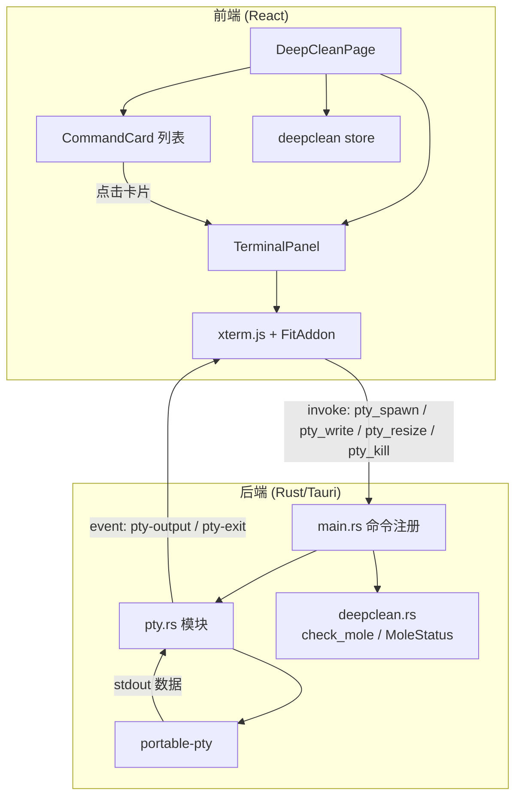
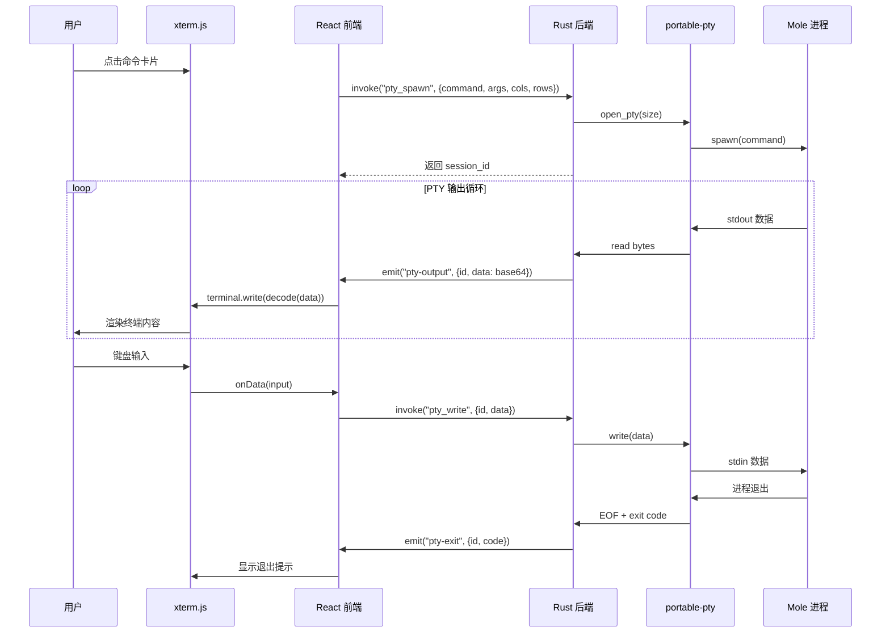

# 嵌入式终端 — 设计文档

## 概述

本设计将 StowMind 深度清理页面从 GUI 包装 Mole CLI 输出的方式，重构为内嵌 PTY 终端方案。核心思路：

1. **Rust 后端**新增 `pty.rs` 模块，使用 `portable-pty` crate 创建跨平台伪终端会话，通过 Tauri invoke/event 与前端双向通信
2. **前端**新增 `TerminalPanel` 组件，基于 xterm.js + @xterm/addon-fit 渲染终端，接收 PTY 输出并转发用户输入
3. **DeepCleanPage** 重构为命令卡片 + 终端面板布局，点击卡片即在应用内运行 Mole 交互式命令
4. **简化** `deepclean.rs` 仅保留 `check_mole`/`MoleStatus`，移除所有 scan/execute 函数；前端 store 同步精简

数据流：

```
用户按键 → xterm.js onData → invoke("pty_write") → portable-pty stdin
portable-pty stdout → Tauri event("pty-output") → xterm.js terminal.write()
```

## 架构



### 关键设计决策

| 决策 | 选择 | 理由 |
|------|------|------|
| PTY 库 | `portable-pty` | 跨平台（Unix PTY + Windows ConPTY），Rust 生态成熟，API 简洁 |
| 终端渲染 | xterm.js + @xterm/addon-fit | 业界标准 Web 终端模拟器，完整 ANSI 支持，自动适配容器尺寸 |
| 数据编码 | PTY 输出 base64 编码传输 | Tauri 事件通道传输二进制数据需要序列化，base64 是最简单可靠的方案 |
| 会话管理 | `HashMap<u32, PtySession>` + `Mutex` | 支持多会话（虽然当前只需单会话），线程安全，ID 自增 |
| 通信方式 | invoke（前端→后端）+ event（后端→前端） | Tauri 1.5 标准模式，invoke 用于请求/响应，event 用于流式推送 |

## 组件与接口

### 1. PTY 后端模块 (`src-tauri/src/pty.rs`)


#### 核心结构

```rust
use portable_pty::{CommandBuilder, PtySize, native_pty_system};
use std::collections::HashMap;
use std::sync::{Arc, Mutex};
use std::sync::atomic::{AtomicU32, Ordering};

/// 单个 PTY 会话
struct PtySession {
    writer: Box<dyn std::io::Write + Send>,
    /// 用于终止子进程
    child: Box<dyn portable_pty::Child + Send>,
}

/// 全局 PTY 管理器，作为 Tauri State 注入
pub struct PtyManager {
    sessions: Arc<Mutex<HashMap<u32, PtySession>>>,
    next_id: AtomicU32,
}
```

#### Tauri 命令接口

| 命令 | 参数 | 返回值 | 说明 |
|------|------|--------|------|
| `pty_spawn` | `command: String, args: Vec<String>, cols: u16, rows: u16` | `Result<u32, String>` | 创建 PTY 会话，启动子进程，返回会话 ID |
| `pty_write` | `id: u32, data: String` | `Result<(), String>` | 将用户输入写入 PTY stdin |
| `pty_resize` | `id: u32, cols: u16, rows: u16` | `Result<(), String>` | 调整 PTY 窗口大小 |
| `pty_kill` | `id: u32` | `Result<(), String>` | 终止子进程，释放 PTY 资源 |

#### Tauri 事件

| 事件名 | Payload | 说明 |
|--------|---------|------|
| `pty-output` | `{ id: u32, data: String }` | PTY stdout 数据（base64 编码） |
| `pty-exit` | `{ id: u32, code: Option<u32> }` | 子进程退出通知 |

#### `pty_spawn` 流程

1. 使用 `native_pty_system()` 获取平台 PTY 实现
2. 以 `PtySize { rows, cols, .. }` 打开 PTY pair
3. 构建 `CommandBuilder`，设置 command/args，继承 `PATH` 环境变量
4. 在 PTY slave 上 spawn 子进程
5. 获取 PTY master 的 reader/writer
6. 将 writer + child 存入 `PtyManager.sessions`
7. 启动 `tokio::spawn` 读取线程：循环读取 reader → base64 编码 → `window.emit("pty-output", ...)`
8. 读取线程结束时 emit `pty-exit` 事件
9. 返回会话 ID

### 2. 简化后的 deepclean 模块 (`src-tauri/src/deepclean.rs`)

保留内容：
- `MoleStatus` 结构体
- `check_mole()` 函数
- `current_platform()` / `mo_cmd()` / `extract_version()` 辅助函数

移除内容：
- `CleanCategory`、`CleanResult`、`PurgeItem`、`AnalyzeEntry`、`AnalyzeResult`、`MoleScanProgress`
- `mole_clean_scan`、`mole_clean_execute`、`mole_purge_scan`、`mole_purge_execute`、`mole_analyze`
- `strip_ansi`、`mo_command`、`parse_clean_output`、`parse_purge_output`、`parse_freed_space`、`parse_name_size`

### 3. main.rs 命令注册变更

移除的命令：
- `mole_clean_scan`、`mole_clean_execute`、`mole_purge_scan`、`mole_purge_execute`、`mole_analyze`、`mole_open_terminal`

新增的命令：
- `pty_spawn`、`pty_write`、`pty_resize`、`pty_kill`

保留的命令：
- `mole_check`（调用 `deepclean::check_mole()`）

新增 State 管理：
```rust
.manage(PtyManager::new())
```

### 4. 前端 TerminalPanel 组件 (`src/components/TerminalPanel.tsx`)

```typescript
interface TerminalPanelProps {
  /** 要执行的命令，如 "mo" 或 "mo clean" */
  command: string
  /** 关闭终端回调 */
  onClose: () => void
}
```

#### 生命周期

1. **挂载时**：
   - 创建 `Terminal` 实例 + `FitAddon`
   - 调用 `terminal.open(containerRef)` + `fitAddon.fit()`
   - 获取 cols/rows，调用 `invoke("pty_spawn", { command: "mo", args, cols, rows })`
   - 监听 Tauri 事件 `pty-output`：base64 解码 → `terminal.write(Uint8Array)`
   - 监听 Tauri 事件 `pty-exit`：显示退出提示
   - 注册 `terminal.onData(data => invoke("pty_write", { id, data }))`
   - 注册 `ResizeObserver` → `fitAddon.fit()` → `invoke("pty_resize", { id, cols, rows })`

2. **卸载时**：
   - 调用 `invoke("pty_kill", { id })`
   - 取消所有事件监听
   - 销毁 Terminal 实例

### 5. 重构后的 DeepCleanPage (`src/pages/DeepCleanPage.tsx`)

#### 页面状态

```typescript
type PageView = 'cards' | 'terminal'

// 组件内状态
const [view, setView] = useState<PageView>('cards')
const [activeCommand, setActiveCommand] = useState<string>('')
```

#### 命令卡片列表

| 命令 | 图标 | 描述 |
|------|------|------|
| `mo` | Terminal | 交互式主菜单 |
| `mo clean` | Trash2 | 系统缓存清理 |
| `mo purge` | FolderX | 构建产物清理 |
| `mo analyze` | HardDrive | 磁盘空间分析 |
| `mo optimize` | Zap | 系统优化 |
| `mo uninstall` | PackageX | 应用卸载管理 |
| `mo status` | Activity | 系统状态查看 |
| `mo installer` | Download | 安装器管理 |

#### 交互流程

1. 页面加载 → 检测 Mole 安装状态（`invoke("mole_check")`）
2. 未安装 → 显示安装引导（保留现有逻辑）
3. 已安装 → 显示命令卡片网格 + Mole 品牌区
4. 点击卡片 → `setView('terminal')` + `setActiveCommand(cmd)`
5. 终端视图 → 显示 TerminalPanel + 关闭按钮
6. 关闭终端 → `setView('cards')`

### 6. 简化后的 deepclean store (`src/stores/deepclean.ts`)

```typescript
interface DeepCleanState {
  moleStatus: MoleStatus | null
  moleChecked: boolean
  setMoleStatus: (status: MoleStatus) => void
}
```

移除所有 tab、cleanItems、purgeItems、analyzeResult、scanLog 等状态。

## 数据模型

### PTY 会话数据流



### Rust 数据结构

```rust
// pty-output 事件 payload
#[derive(Clone, Serialize)]
pub struct PtyOutput {
    pub id: u32,
    pub data: String,  // base64 编码的字节数据
}

// pty-exit 事件 payload
#[derive(Clone, Serialize)]
pub struct PtyExit {
    pub id: u32,
    pub code: Option<u32>,
}

// pty_spawn 参数
#[derive(Deserialize)]
pub struct PtySpawnArgs {
    pub command: String,
    pub args: Vec<String>,
    pub cols: u16,
    pub rows: u16,
}
```

### 前端类型

```typescript
// Tauri 事件 payload
interface PtyOutputEvent {
  id: number
  data: string  // base64
}

interface PtyExitEvent {
  id: number
  code: number | null
}

// Mole 安装状态（保留）
interface MoleStatus {
  installed: boolean
  version: string | null
  platform: 'macos' | 'windows' | 'linux'
}

// 命令卡片定义
interface CommandDef {
  command: string
  args: string[]
  icon: LucideIcon
  titleKey: string
  descKey: string
}
```


## 正确性属性

*属性（Property）是指在系统所有合法执行路径中都应成立的特征或行为——本质上是对系统行为的形式化陈述。属性是连接人类可读规格说明与机器可验证正确性保证之间的桥梁。*

### 属性 1：会话 ID 唯一性

*对于任意* 一组 `pty_spawn` 调用序列，每次调用返回的会话 ID 都应与之前所有返回的 ID 不同。

**验证需求：1.1**

### 属性 2：PTY 输出数据传输完整性（往返属性）

*对于任意* 字节序列，经过 base64 编码后通过 `pty-output` 事件传输，再经 base64 解码后，应得到与原始字节序列完全相同的数据。

**验证需求：1.3, 2.2**

### 属性 3：已终止会话的操作拒绝

*对于任意* 已通过 `pty_kill` 终止的会话 ID，后续对该 ID 的 `pty_write` 或 `pty_resize` 调用都应返回错误。

**验证需求：1.6**

### 属性 4：输入数据完整性

*对于任意* 通过 `pty_write` 发送的字符串数据，写入 PTY stdin 的字节应与输入字符串的字节表示完全一致，不做任何转义或编码转换。

**验证需求：4.3**

### 属性 5：Mole 未安装时的 UI 状态一致性

*对于任意* `MoleStatus` 其中 `installed = false`，DeepCleanPage 应同时满足：(a) 显示安装引导界面，(b) 所有 Command_Card 处于禁用状态不可点击。

**验证需求：3.4, 3.6**

## 错误处理

### 后端错误处理

| 场景 | 处理方式 |
|------|----------|
| PTY 创建失败 | `pty_spawn` 返回 `Err(String)` 包含失败原因（如 "平台不支持 PTY"） |
| 写入无效会话 | `pty_write` 返回 `Err("会话不存在或已关闭")` |
| 调整无效会话大小 | `pty_resize` 返回 `Err("会话不存在或已关闭")` |
| 终止无效会话 | `pty_kill` 返回 `Err("会话不存在")`，但不影响其他会话 |
| PTY 读取线程异常 | 发送 `pty-exit` 事件（code = None），清理会话资源 |
| 子进程非零退出 | 发送 `pty-exit` 事件携带退出码，前端显示提示 |

### 前端错误处理

| 场景 | 处理方式 |
|------|----------|
| `pty_spawn` 失败 | 在终端区域显示错误信息，提供"重试"和"在系统终端打开"按钮 |
| `pty_write` 失败 | 静默忽略（可能是会话已关闭的竞态） |
| Mole 未安装 | 显示安装引导页面，禁用所有命令卡片 |
| PTY 不支持（回退） | 显示提示信息，提供"在系统终端中打开"按钮作为回退方案 |
| 组件卸载时会话仍活跃 | 在 `useEffect` cleanup 中调用 `pty_kill`，确保资源释放 |

## 测试策略

### 双重测试方法

本功能采用单元测试 + 属性测试的双重策略：

- **单元测试**：验证具体示例、边界情况和错误条件
- **属性测试**：验证跨所有输入的通用属性

两者互补，缺一不可。

### 属性测试

使用 `proptest` crate（Rust）和 `fast-check`（TypeScript）作为属性测试库。

每个属性测试至少运行 100 次迭代。每个测试必须用注释标注对应的设计属性。

标注格式：**Feature: embedded-terminal, Property {number}: {property_text}**

| 属性 | 测试库 | 测试内容 |
|------|--------|----------|
| 属性 1：会话 ID 唯一性 | proptest (Rust) | 生成随机数量的 spawn 调用，验证所有返回 ID 互不相同 |
| 属性 2：数据传输完整性 | fast-check (TS) | 生成随机字节数组，验证 base64 编码→解码的往返一致性 |
| 属性 3：已终止会话拒绝 | proptest (Rust) | 生成随机会话，kill 后验证 write/resize 返回错误 |
| 属性 4：输入数据完整性 | proptest (Rust) | 生成随机字符串，验证 pty_write 写入的字节与输入一致 |
| 属性 5：未安装 UI 状态 | fast-check (TS) | 生成随机 MoleStatus（installed=false），验证 UI 状态 |

每个正确性属性由单个属性测试实现。

### 单元测试

| 测试范围 | 框架 | 测试内容 |
|----------|------|----------|
| PtyManager 基本操作 | Rust #[test] | spawn → write → kill 的完整生命周期 |
| check_mole 函数 | Rust #[test] | Mole 已安装/未安装两种情况 |
| TerminalPanel 组件 | Vitest + React Testing Library | 挂载/卸载、事件监听注册/清理 |
| DeepCleanPage 命令卡片 | Vitest + React Testing Library | 卡片渲染、点击交互、禁用状态 |
| base64 编解码 | Vitest | 边界情况：空数据、大数据、特殊字符 |
| 退出事件处理 | Vitest | 收到 pty-exit 后显示提示信息 |

### 集成测试

| 测试范围 | 说明 |
|----------|------|
| PTY 端到端 | 启动 `echo hello` → 验证收到 "hello" 输出 → 验证收到退出事件 |
| PATH 继承 | 启动 `env` 命令 → 验证输出包含系统 PATH |
| 窗口大小调整 | spawn → resize → 验证 PTY 接受新尺寸（无错误） |
